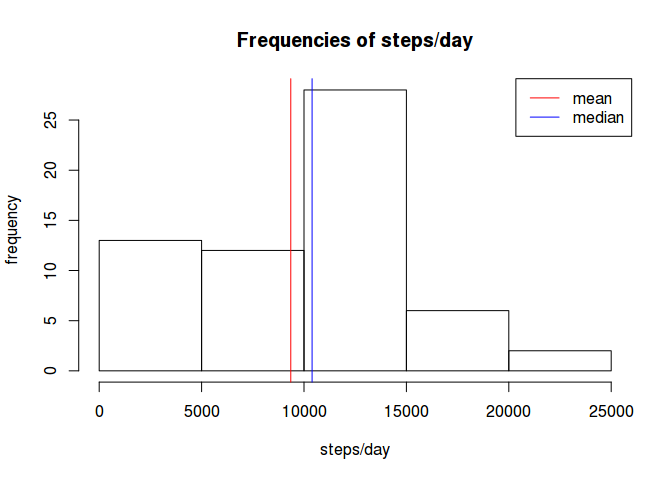
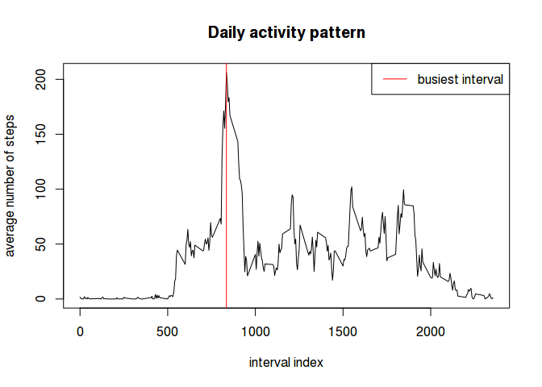
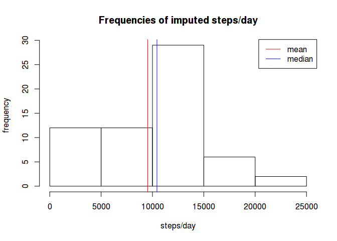
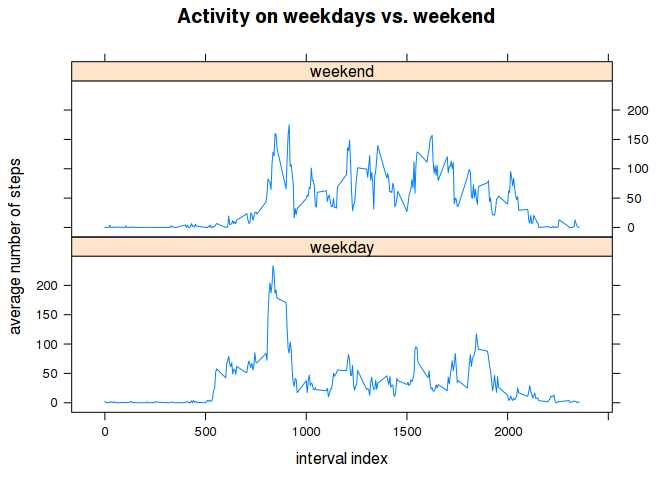

# Reproducible Research: Peer Assessment 1


## Loading and preprocessing the data

```r
library("dplyr")
library("lubridate")
library("lattice")
```


```r
if (!file.exists("activity.csv"))
    unzip("activity.zip", files = c("activity.csv"))

activity <- tibble::as_tibble(read.csv("activity.csv"))
activity$date <- ymd(activity$date)
```

## What is mean total number of steps taken per day?

```r
steps_by_day <- activity %>%
                group_by(date) %>%
                summarize(steps = sum(steps, na.rm = TRUE))

hist(steps_by_day$steps,
     xlab = "steps/day",
     ylab = "frequency",
     main = "Frequencies of steps/day")

mean_of_steps <- mean(steps_by_day$steps)
median_of_steps <- median(steps_by_day$steps)

abline(v = mean_of_steps,   col = "red")
abline(v = median_of_steps, col = "blue")

legend(legend = c("mean", "median"),
       col = c("red", "blue"),
       x = "topright",
       lty = 1)
```

<!-- -->

```r
mean_of_steps
```

```
## [1] 9354.23
```

```r
median_of_steps
```

```
## [1] 10395
```


## What is the average daily activity pattern?


```r
daily_activity <- activity %>%
                  group_by(interval) %>%
                  summarize(steps = mean(steps, na.rm = TRUE))

plot(daily_activity$interval, daily_activity$steps,
     type = "l",
     xlab = "interval index",
     ylab = "average number of steps",
     main = "Daily activity pattern")

busiest_interval <- daily_activity$interval[which.max(daily_activity$steps)]

abline(v = busiest_interval, col = "red")

legend(legend = c("busiest interval"),
       col = c("red"),
       x = "topright",
       lty = 1)
```

<!-- -->

```r
busiest_interval
```

```
## [1] 835
```

## Imputing missing values


```r
num_missing_values <- sum(is.na(activity$steps))
num_missing_values
```

```
## [1] 2304
```

```r
# substitute NAs with the avg num of steps for that interval
activity_imputed <- activity %>%
                    mutate(steps = ifelse(is.na(steps),
                                          daily_activity[daily_activity$interval == interval,]$steps,
                                          steps))

steps_by_day_imputed <- activity_imputed %>%
                        group_by(date) %>%
                        summarize(steps = sum(steps, na.rm = TRUE))

hist(steps_by_day_imputed$steps,
     xlab = "steps/day",
     ylab = "frequency",
     main = "Frequencies of imputed steps/day")

mean_of_steps_imputed <- mean(steps_by_day_imputed$steps)
median_of_steps_imputed <- median(steps_by_day_imputed$steps)

abline(v = mean_of_steps_imputed,   col = "red")
abline(v = median_of_steps_imputed, col = "blue")

legend(legend = c("mean", "median"),
       col = c("red", "blue"),
       x = "topright",
       lty = 1)
```

<!-- -->

```r
mean_of_steps_imputed
```

```
## [1] 9530.724
```

```r
median_of_steps_imputed
```

```
## [1] 10439
```


## Are there differences in activity patterns between weekdays and weekends?


```r
activity_imputed <- activity_imputed %>%
                    mutate(daytype = factor(ifelse(between(wday(date), 2, 6), "weekday", "weekend")))

daily_activity_imputed <- activity_imputed %>%
                          group_by(interval, daytype) %>%
                          summarize(steps = mean(steps, na.rm = TRUE))

xyplot(steps ~ interval | daytype, 
       data = daily_activity_imputed,
       type = "l",
       layout = c(1, 2),
       xlab = "interval index",
       ylab = "average number of steps",
       main = "Activity on weekdays vs. weekend")
```

<!-- -->
<!-- vim: set ts=4 sw=4 et tw=80 cc=80: -->
